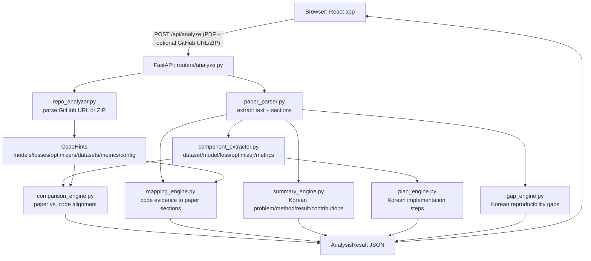

# PRISM

**Paper Reproduction & Implementation Specification Manager**

PRISM is designed as a Korean-first research implementation assistant, helping users understand and reproduce academic papers more efficiently.

PRISM is a web service that analyzes a research paper PDF alongside optional GitHub repository or ZIP code, then returns a structured breakdown across six dimensions:

1. **Paper Summary** — Problem, limitation, method, result, contributions
2. **Implementation Plan** — Step-by-step reproduction roadmap
3. **Research Components** — Dataset, model, loss, optimizer, metrics, hyperparameters
4. **Paper-Code Comparison** — Side-by-side alignment table with match status
5. **Paper-Code Mapping** — Fine-grained mapping from code blocks to paper sections
6. **Missing Info** — Gaps in the paper's reproducibility

## Stack

| Layer    | Technology                          |
|----------|-------------------------------------|
| Frontend | React 18 + TypeScript + Vite + Tailwind CSS |
| Backend  | FastAPI + Python 3.11               |
| Analysis | Rule-based extraction and generation (PDF parsing, component/repo/comparison/mapping engines, Korean summary/plan/gap engines) |

## Screenshots

> Screenshots aren't captured yet — see [docs/screenshots/README.md](docs/screenshots/README.md)
> for capture guidelines. Once the PNGs below are added, the embeds will render automatically:
>
> ```markdown
> 
> 
> 
> 
> 
> ```
>
> Until then, run the app locally (see [Getting Started](#getting-started)) to see the upload
> form and the six result tabs (Summary, Plan, Components, Comparison, Mapping, Missing Info).

## Architecture



Request flow:

1. The frontend submits the PDF (required) plus an optional GitHub URL or code ZIP to `POST /api/analyze`.
2. `paper_parser.py` extracts raw text and splits it into canonical sections (abstract, introduction, method, experiments, results, etc.).
3. `component_extractor.py` runs rule-based extraction over those sections to find the dataset, model, backbone, loss, optimizer, metrics, and hyperparameters.
4. `repo_analyzer.py` safely reads the ZIP in-memory (or parses the GitHub URL, without cloning yet) and extracts code-level hints from relevant files.
5. `comparison_engine.py` compares paper components against code hints to produce match/mismatch status per item.
6. `mapping_engine.py` links code evidence (models, losses, optimizers, metrics, datasets) back to the paper section that most likely describes it.
7. `summary_engine.py`, `plan_engine.py`, and `gap_engine.py` generate the Korean summary, implementation plan, and reproducibility gaps directly from the detected sections and extracted components — no fixed/mock content.
8. The backend merges all of these real results into a single `AnalysisResult` JSON object and returns it.

## Getting Started

### Backend

```bash
cd backend
python -m venv venv
source venv/bin/activate      # Windows: venv\Scripts\activate
pip install -r requirements.txt
uvicorn main:app --reload --port 8000
```

### Frontend

```bash
cd frontend
npm install
npm run dev
```

Open [http://localhost:5173](http://localhost:5173).

## Environment Variables

Copy `.env.example` to `.env` and fill in values before running.

## API Endpoints

### `GET /health`

Liveness check.

**Response** `200 OK`
```json
{ "status": "ok" }
```

### `POST /api/analyze`

Analyzes a paper PDF, optionally alongside a GitHub repo URL or a code ZIP, and returns the full structured breakdown.

**Request** — `multipart/form-data`

| Field        | Type   | Required | Description                                  |
|--------------|--------|----------|-----------------------------------------------|
| `paper`      | file   | yes      | Research paper PDF                            |
| `github_url` | string | no       | GitHub repository URL (cloning not yet implemented — only `owner/repo` is parsed) |
| `code_zip`   | file   | no       | ZIP archive of the paper's source code         |

**Response** `200 OK` — `AnalysisResult`

```json
{
  "paperInfo": { "filename": "...", "page_count": 0, "text_preview": "...", "extraction_error": null, "sections": { "detected": {}, "total_chars": 0 } },
  "summary": { "problem": "...", "limitation": "...", "method": "...", "result": "...", "contribution": ["..."] },
  "implementationPlan": ["..."],
  "components": { "dataset": { "value": "...", "source": null, "confidence": "High", "found": true }, "...": "..." },
  "repoAnalysis": { "inputType": "zip", "repoName": "...", "status": "...", "relevantFiles": ["..."], "fileCount": 0, "codeHints": { "models": [], "...": "..." } },
  "comparison": [{ "item": "Model", "paper": "...", "code": "...", "status": "Match", "confidence": "High", "explanation": "..." }],
  "mapping": [{ "codeBlock": "...", "paperSection": "...", "paperReference": "...", "explanation": "...", "confidence": "High" }],
  "missingInfo": ["..."]
}
```

See [backend/models/schemas.py](backend/models/schemas.py) for the authoritative field definitions.

## Project Structure

```
PRISM/
├── backend/
│   ├── main.py                  # FastAPI app + CORS
│   ├── paper_parser.py          # PDF text extraction + section detection
│   ├── component_extractor.py   # Rule-based dataset/model/loss/optimizer/metrics extraction
│   ├── repo_analyzer.py         # GitHub URL / ZIP parsing + code hint extraction
│   ├── comparison_engine.py     # Paper-vs-code comparison heuristics
│   ├── mapping_engine.py        # Code-evidence-to-paper-section mapping
│   ├── summary_engine.py        # Korean paper summary generation (problem/limitation/method/result/contribution)
│   ├── plan_engine.py           # Korean implementation plan generation
│   ├── gap_engine.py            # Korean reproducibility gap detection
│   ├── routers/
│   │   └── analyze.py           # POST /api/analyze
│   └── models/
│       └── schemas.py           # Pydantic response models
└── frontend/
    └── src/
        ├── App.tsx
        ├── api.ts
        ├── types.ts
        └── components/
            ├── UploadForm.tsx
            ├── ResultTabs.tsx
            └── tabs/             # One component per result tab
```

## Roadmap

- [x] Mock end-to-end response and tabbed UI scaffold
- [x] Real PDF parsing and section detection
- [x] Rule-based research component extraction
- [x] Repository / ZIP code structure analysis
- [x] Automatic paper-code comparison engine
- [x] Paper-code mapping engine
- [x] Korean, paper-driven summary/plan/missing-info generation
- [ ] Clone and analyze GitHub repositories directly (currently URL-parse only)
- [ ] LLM-assisted summary, plan, and gap generation (currently rule-based)
- [ ] Persist analysis results (currently stateless, single-request only)
- [ ] Authentication and per-user analysis history
